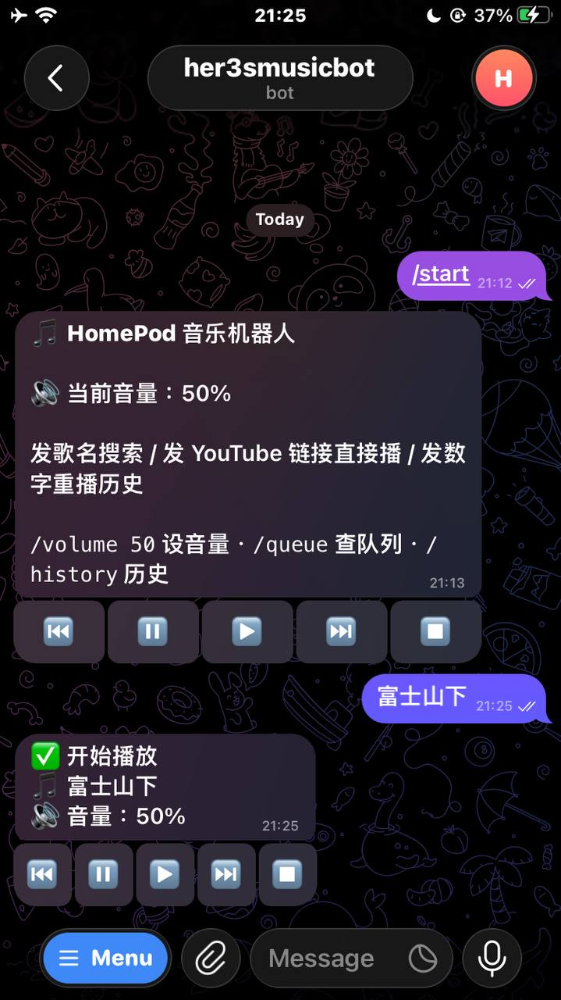
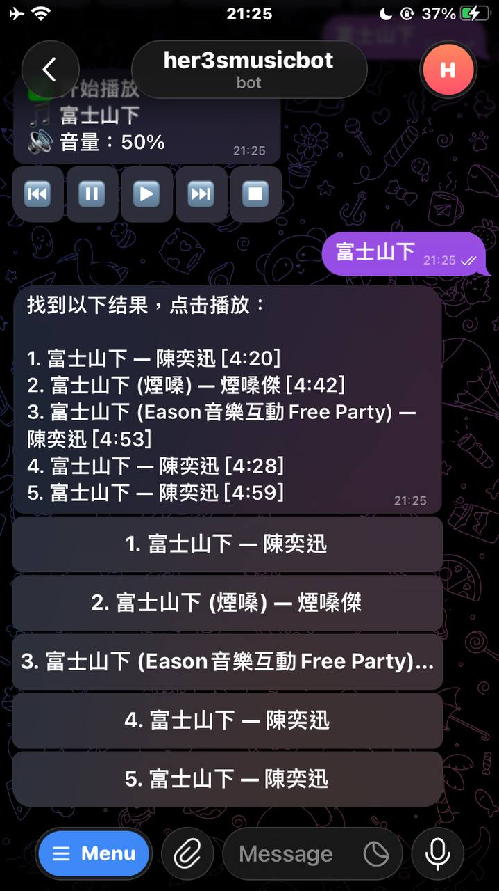

# 🎵 HomePod 音乐机器人

通过 Telegram 控制 HomePod 播放音乐，支持搜索 YouTube、文字点歌、播放控制等功能。

<sub>Hey! It's VibeCoding By Claude</sub>

<table>
  <tr>
    <td></td>
    <td></td>
  </tr>
</table>

[//]: # (@todo add English translation)
[//]: # (@todo add screenshot)
[//]: # (@todo add deployment guide)

## 功能特性

- ▶️ **播放控制**
  - `/play` — 继续播放
  - `/pause` — 暂停
  - `/stop` — 停止并清空队列
  - `/next` — 下一首
  - `/prev` — 上一首
  - `/queue` — 查看当前队列

- 🔊 **音量控制**
  - `/volume` — 查看当前音量
  - `/volume 50` — 设置音量 (0-100)

- 🕘 **播放历史**
  - `/history` — 最近 20 首
  - 发编号重播对应歌曲

- 🗑️ **缓存管理**
  - `/clear` — 清除续播临时文件
  - `/clearforce` — ⚠️ 清除全部历史和音频

- ℹ️ **其他**
  - `/start` — 状态面板
  - `/whoami` — 查看自己的 user_id

- 🎵 **点歌方式**
  - 直接发送歌名搜索 YouTube 并播放
  - 直接发送 YouTube 链接播放

## 快速部署

### 1. 克隆项目

```bash
git clone https://github.com/zhou-hack/telegram2homepod.git
cd telegram2homepod
```

### 2. 配置环境变量

```bash
cp env.example .env
# 编辑 .env 填入配置
```

### 3. Docker 部署（推荐）

```bash
docker-compose up -d
```

### 4. 手动部署

```bash
# Ubuntu/Debian 需要先安装 ffmpeg
sudo apt install ffmpeg

pip install -r requirements.txt
python main.py
```

> ⚠️ **注意**：Docker 部署已内置 ffmpeg，无需手动安装。

## 配置说明

| 变量 | 说明 | 必填 |
|-----|------|-----|
| `BOT_TOKEN` | Telegram Bot Token | ✅ |
| `ALLOWED_USERS` | 允许使用的用户 ID，用逗号分隔 | ✅ |
| `HOMEPOD_IP` | HomePod 的局域网 IP 地址 | ✅ |
| `HOMEPOD_ID` | HomePod 的 MAC 地址（如 `3A:EE:78:XX:XX:XX`） | ✅ |

获取 Telegram Bot Token: [@BotFather](https://t.me/BotFather)

### 获取设备信息

使用 `atvremote scan` 扫描局域网中的 Apple 设备：

```bash
pip install pyatv
atvremote scan
```

输出示例：

```
Scan Results
========================================
 Name: 书房
 Model/SW: HomePod Mini, tvOS 18.3
 Address: 10.0.4.XX
 MAC: 3A:EE:78:XX:XX:XX
 Deep Sleep: False
Services:
 - Protocol: AirPlay, Port: 7000
 - Protocol: RAOP, Port: 7000
```

> ⚠️ **网络要求**：部署此 Bot 的服务器必须与 HomePod 处于**同一个局域网**（同一路由器下）。如果您使用 Docker 部署，请确保 `docker-compose.yml` 中使用了 `network_mode: "host"`。

## 技术栈

- Python 3.10+
- [python-telegram-bot](https://github.com/python-telegram-bot/python-telegram-bot) — Telegram Bot API
- [pyatv](https://github.com/postlund/pyatv) — Apple TV/HomeKit 控制
- [yt-dlp](https://github.com/yt-dlp/yt-dlp) — YouTube 下载

## License

MIT
